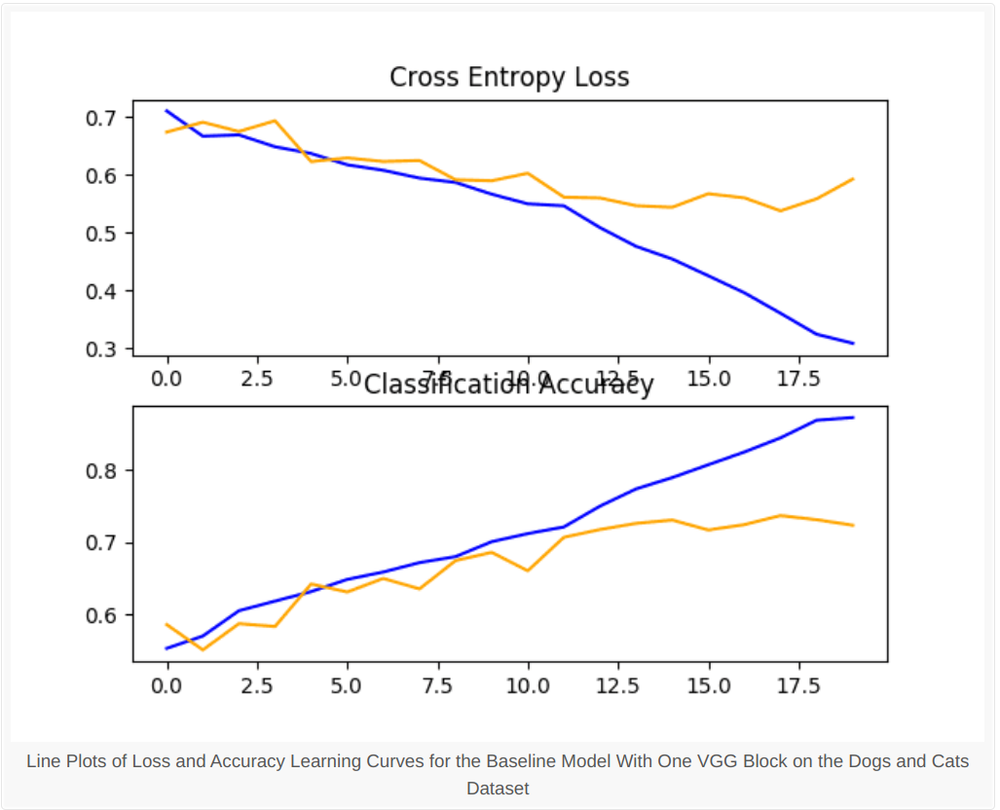
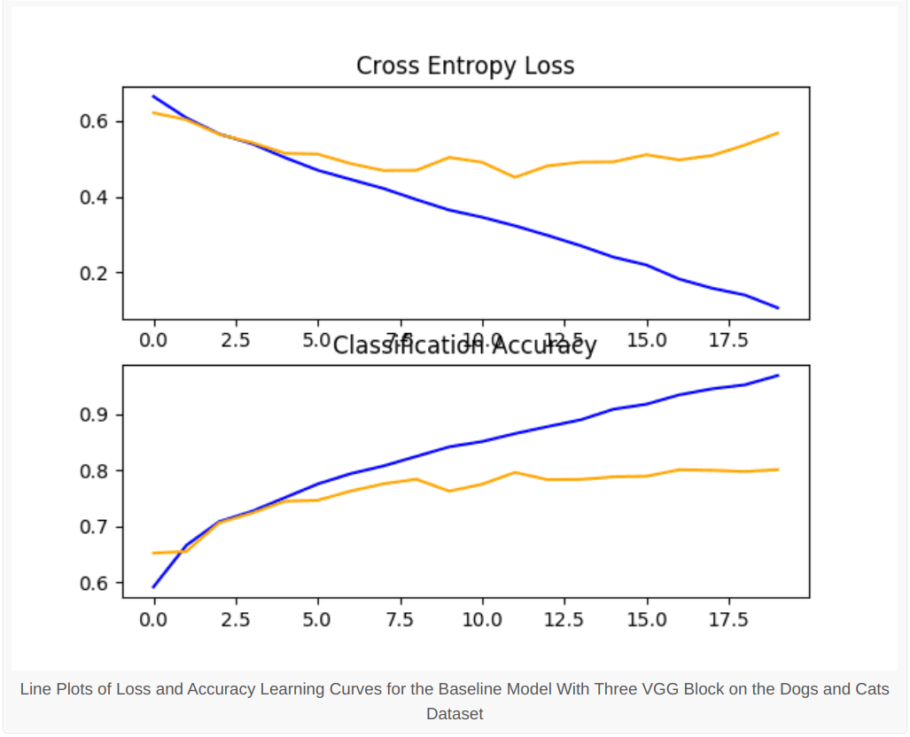
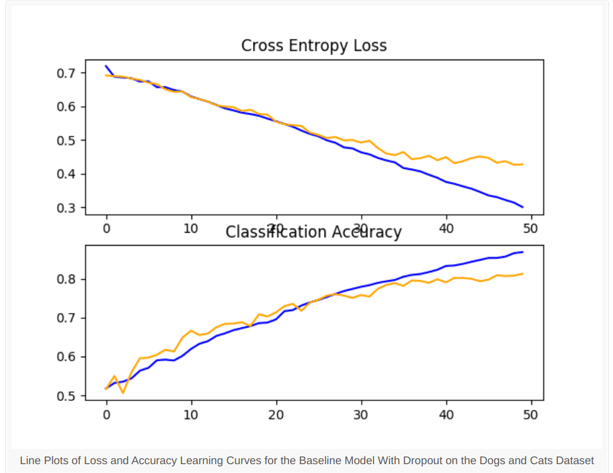
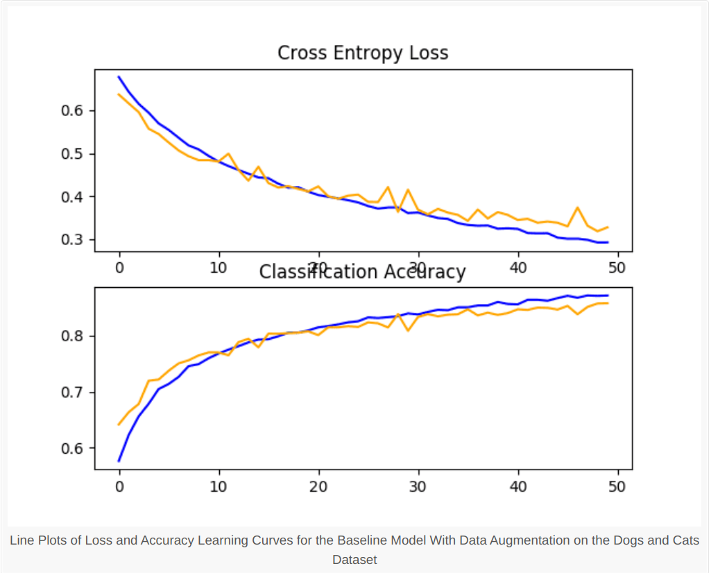

# Feline-And-Canine-Image-Classifier
## Installation
- Download the dataset from [here](https://www.microsoft.com/en-us/download/details.aspx?id=54765).
- Extract the dataset zip file, You will find a subfolder `PetImages` in it. Move that folder into main directory where all the files are kept.
- Make sure you install all the necessary python libraries. The libraries are numpy, matplotlib, os, shutil, keras, tensorflow, PIL.
- Run model.ipynb to train model. Training time might vary depending on your machine.
## Dataset
The dataset consist of 25000 cat and dog images. During training I noticed that some of the images in dataset were corrupted. This was fixed by deleting all corrupted images which can't be open.
## Model
The input are images so we will use CNN layers to extract features. The model was intially a single block VGG which was then modified into 3 block VGG. To prevent overfitting and improve accuracy dropout regularization was added after each layer. The data was also mixed with noise using data augmentation which further improved the accuracy to 85%.
The task is binary classification so the final output layer will only have one neuron. The number of filters will increase with each block as in VGG from 32 to 128.
## Results
The first training was done with single block VGG. The accuracy achieved was 72%.
Below are the training Loss Vs Epoch and Accuracy Vs Epoch graphs:

The second training was done with three block VGG with double number of filters at each layer. The accuracy achieved was 76%.
Below are the training Loss Vs Epoch and Accuracy Vs Epoch graphs:

Dropout Regularization was done at each layer which reduced the overfitting. It also improved the accuracy to 80%.
Below are the training Loss Vs Epoch and Accuracy Vs Epoch graphs:

To further improve accuracy we put noise in data and augmeneted images. The accuracy is 85% finally.
Below are the training Loss Vs Epoch and Accuracy Vs Epoch graphs:
